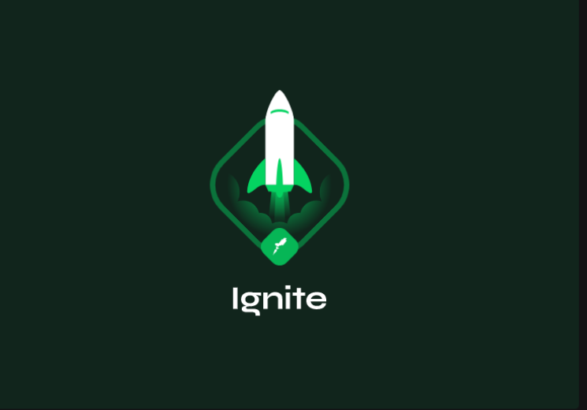

<h1 align="center">
    
</h1>

This is a repository for the Ignite Trilha Node.js course

🚧 **Challenge-one - Node.js concepts** 🚧


## Challenge one - Ignite

### Requirements

- [x] Should be able to create a new user
- [x] Should be able to list all user's todos
- [x] Should be able to create a new todo
- [x] Should be able to update a todo
- [x] Should be able to mark a todo as done
- [x] Should be able to delete a todo


### Rules

- [x] Should not be able to create a new user when username already exists
- [x] Should not be able to update a non existing todo
- [x] Should not be able to mark a non existing todo as done
- [x] Should not be able to delete a non existing todo

## Layout

Soon we will have a complementary application for using this api.


## Contributions

This repository is currently under development. If you want to contribute, fork the repository and get your hands dirty, make changes as you wish and send the Pull request.

## Building

You will need [Node.js] (https://nodejs.org) installed on your computer to build this application.

```bash
git clone https://github.com/AndreMezavila/ignite-nodejs-Challenge-one.git
$ cd ignite-nodejs-Challenge-one
$ yarn install
$ yarn dev
```

## License

This project is under the MIT license. See the [LICENSE] file (LICENSE.md) for more details.

This application is still in development mode. <br/>
 